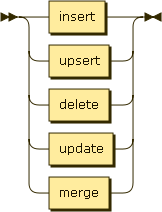
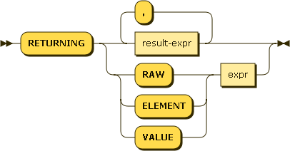
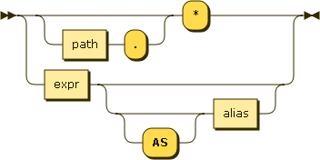
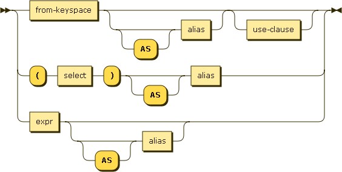

# N1QL Query Language&mdash;DML

* Status: DRAFT/PROPOSAL
* Latest: [n1ql-dml](https://github.com/couchbaselabs/query/blob/master/docs/n1ql-dml.md)
* Modified: 2014-07-02

## Introduction

N1QL ("nickel") is the query language from Couchbase. N1QL aims to
meet the query needs of distributed document-oriented databases. This
document specifies the syntax and semantics of the data modification
statements in N1QL.

*N1QL* stands for Non-1st Query Language. The name reflects the fact
that the Couchbase document-oriented data model is based on [Non-1st
Normal Form
(N1NF)](http://en.wikipedia.org/wiki/Database_normalization#Non-first_normal_form_.28NF.C2.B2_or_N1NF.29).

## DML statements

N1QL provides several data modification statements.

*dml-stmt:*

## INSERT

*insert:*

*bucket-ref:*

*bucket-name:*

*key-clause:*

*values-clause:*

*returning-clause:*

*result-expr:*

## UPSERT

*upsert:*

## DELETE

*delete:*

*keys-clause:*

*where-clause:*

*limit-clause:*

## UPDATE

*update:*

*set-clause:*

*update-for:*

*unset-clause:*

## MERGE

*merge:*

*merge-source:*

*merge-update:*

*merge-delete:*

*merge-insert:*

<!--

## TRUNCATE

TRUNCATE deletes all the documents in a bucket. It cannot be rolled
back, and it cannot be called within or participate in transactions.

*truncate:*

**NOTE:** Because we are distributed and support XDCR, TRUNCATE would
need to work correctly and efficiently across partitions and across
data centers, even as data flows into the bucket.

One possibility is to first broadcast a BUCKET CLEAR message that
causes the bucket to stop accepting new mutations and to be empty for
new queries. Once the BUCKET CLEAR is coordinated, the final TRUNCATE
can be completed (while completing already-started queries).

We may postpone TRUNCATE if the implementation makes it expedient to
do so. Also, we will only expose TRUNCATE via N1QL after the backend
support for it is in place, and perhaps in conjunction with an
administrative API that abstracts / hides all the management and
book-keeping for distributed correctness.

## SELECT-FOR

*select-for:*

## Transactions

### Start transaction

*start:*

### Commit

*commit:*

### Rollback

*rollback:*

-->

## About this Document

The
[grammar](https://github.com/couchbaselabs/query/blob/master/docs/n1ql-dml.ebnf)
forming the basis of this document is written in a [W3C dialect of
EBNF](http://www.w3.org/TR/REC-xml/#sec-notation).

This grammar has not yet been converted to an actual implementation,
ambiguities and conflicts may still be present.

Diagrams were generated by [Railroad Diagram
Generator](http://railroad.my28msec.com/) 

### Document History

* 2013-07-07 - Initial checkin
    * UPDATE, DELETE, INSERT-VALUES, and INSERT-SELECT
    * Datasets
    * WHERE clauses in INSERT statements
    * RETURNING clauses
* 2013-07-08 - Added to open issues
* 2013-07-12 - Result sets
    * DML statements return result sets (same as SELECT)
* 2013-07-12 - EBNF
    * Added EBNF for dml-stmt
* 2013-07-19 - Merge, Insert-Values, cond
    * Added MERGE statement for upserts, based on input from prod mgmt
    * Moved WHERE clause in INSERT-VALUES syntax
    * Added cond to EBNF diagrams
* 2013-07-30 - Update-Rename, Truncate
    * Added UPDATE-RENAME clause
    * Added TRUNCATE statement
* 2013-07-30 - Truncate
    * Required BUCKET after TRUNCATE, to make it more self-documenting
    * Clarified that TRUNCATE does not participate in transactions
* 2013-12-15 - Target syntax
    * Updated syntax targeting beta / production release
    * DML statements apply to documents, not fragments
    * Transaction START / COMMIT / ROLLBACK statements
* 2014-01-03 - MERGE
    * Restricted MERGE to key-based matching
    * Made LIMIT mandatory in MERGE
* 2014-01-21 - Collection expressions
    * Per customer requirement, extend collection expressions to
      multiple collections
    * Customer requirement: If you have a property that is an array of
      subdocuments like the children property in your examples, it
      looks easy to find the documents where there is a child with the
      gender equal to female and the age greater than 12 say for
      example.  Now suppose the data is stored differently.  There are
      now two properties in the document, each being an array, one for
      the list of children genders and one for the list of children
      ages.  In this case the gender on line one corresponds to the
      age on line one.  How would you search the document such that
      the lines matched up?  How do you make sure the line that is
      female is also the line where the age is greater than 12?  Now
      take that one step further and put the two properties into two
      separate documents.  You still want to find the documents where
      the search criteria are true on the same line in each document.
      How do you do that?  We need to be able to relate multiple
      properties together on a line by line basis and they may be
      stored separately.
* 2014-02-06 - Transactions
    * Removed transaction statements for now.
* 2014-02-12 - UPSERT
    * Added UPSERT option to INSERT
* 2014-02-13 - RETURNING
    * Omit result expressions to return raw value
* 2014-02-16 - RETURNING RAW
    * Added RETURNING RAW
* 2014-02-17 - KEY / KEYS
    * Cleaned up usage of KEY and kEYS.
* 2014-02-18 - RETURNING list
    * Require RETURNING list
* 2014-06-24 - VALUES exprs
    * Changed VALUES to multiple exprs
* 2014-06-24 - RETURNING star
    * Allow star in RETURNING
* 2014-07-02 - MERGE source
    * Support VALUES as MERGE source
    * Allow JOIN sources to be aliased

### Open Issues

This meta-section records open issues in this document, and will
eventually disappear.
